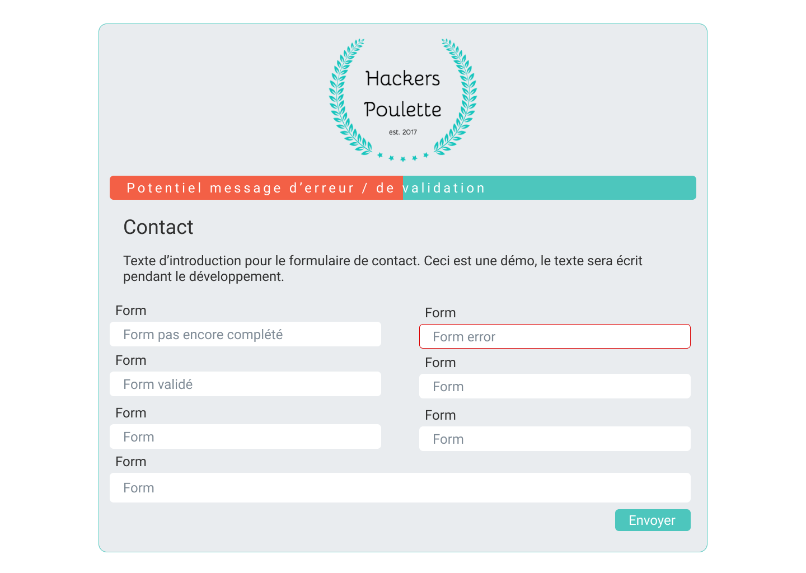

# Hackers-Poulette

## Description

Voici un formulaire de contact pour une entreprise fictive nommée "Hackers Poulette" développé en PHP, HTML, CSS (bootstrap utilisé pour la grille).  
Ce projet a été réalisé en 4 jours.
Ce dernier dispose d'une gestion de formulaires non remplis / non conformes.

## Technologies utilisées

* PHP
* HTML
* CSS
* Bootstrap

## Version finale
  
### Desktop

  

### Mobile

 

## Mockup Low Fidelity

### Desktop

 

### Mobile

 

 
